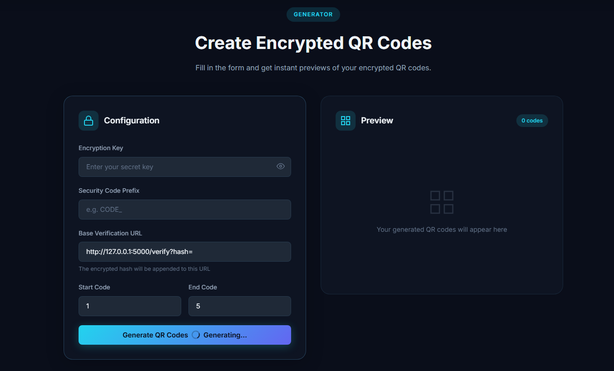
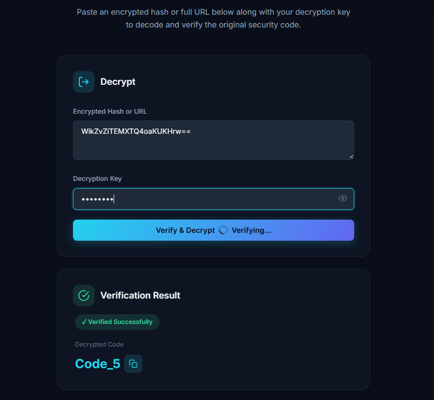

# 🔐 SecureQR — Encrypted QR Code Generator

A modern web application that generates QR codes containing **AES-256 encrypted URLs**. Built with Flask, featuring a premium dark-themed UI, live QR previews, and a built-in verification tool to test and decrypt encrypted URLs — all from your browser.


---

## 📸 Screenshots

### QR Code Generator
Generate encrypted QR codes with a clean, intuitive interface. Configure your encryption key, code prefix, verification URL, and code range — then get instant live previews.



### URL Verification & Testing
Paste any encrypted hash or full verification URL and decrypt it instantly. Perfect for testing your QR codes before printing or distributing them.



---

## ✨ Features

| Feature | Description |
|---------|-------------|
| 🔐 **AES-256-CBC Encryption** | Military-grade encryption ensures QR code data remains completely secure and tamper-proof |
| ⚡ **Batch Generation** | Generate up to 100 encrypted QR codes at once with instant live previews |
| 🔍 **Built-in Verification** | Test and decrypt encrypted URLs right in the browser — no external tools needed |
| 📥 **One-Click Download** | Download individual QR codes as high-quality PNG images |
| 🕘 **Session History** | Browse, manage, and re-download all QR codes generated during your session |
| 🎨 **Premium Dark UI** | Glassmorphism design, smooth animations, and fully responsive layout |
| 📋 **Copy to Clipboard** | Instantly copy encrypted URLs to share with your team |

---

## 💡 Use Cases

SecureQR is designed for any scenario where you need **tamper-proof, verifiable QR codes**. Here are some real-world applications:

### 🏠 Real Estate & Property
- Attach encrypted QR codes to **property listing documents** — buyers scan to verify authenticity and access secure property details
- Place QR codes on **"For Sale" signs** that link to encrypted, verified listing pages only your agency controls
- Secure **lease agreements and title deeds** with verifiable QR codes to prevent forgery

### 📦 Product Authentication & Anti-Counterfeiting
- Print QR codes on **product packaging** so customers can verify they purchased a genuine item
- Attach encrypted labels to **luxury goods, electronics, or pharmaceuticals** for supply chain verification
- Enable **batch tracking** by assigning unique encrypted QR codes to every unit in a production run

### 🎟️ Event Tickets & Access Control
- Generate encrypted QR codes for **concert tickets, conference badges, or VIP passes** — each code is unique and tamper-proof
- Prevent **ticket duplication and fraud** since codes can only be verified with the correct decryption key
- Manage **entry points** by scanning and verifying codes at the door

### 📜 Certificate & Document Verification
- Embed QR codes in **academic certificates, diplomas, or professional certifications** for instant verification
- Secure **legal documents, contracts, and compliance records** with verifiable encrypted codes
- Government agencies can use them for **ID cards, permits, or official letters**

### 🏥 Healthcare & Pharmaceuticals
- Attach QR codes to **prescription labels** for pharmacists to verify authenticity
- Track **medical equipment and devices** through encrypted QR codes in the supply chain
- Secure **patient records** shared between facilities with encrypted verification links

### 🏭 Manufacturing & Logistics
- Track items through the **supply chain** — each QR code is encrypted and tied to a specific batch or unit
- Verify **spare parts authenticity** before installation
- Streamline **warehouse inventory management** with scannable encrypted labels

### 🎓 Education & Training
- Secure **course completion certificates** with verifiable QR codes
- Protect **exam papers and answer sheets** from unauthorized reproduction
- Verify **student ID cards** at institutional entry points

---

## 🚀 Quick Start

### 1. Clone & Install

```bash
git clone https://github.com/maazmasood/SecureQRCodeGenerator.git
cd SecureQRCodeGenerator
pip install -r requirements.txt
```

### 2. Run the App

```bash
python app.py
```

### 3. Open in Browser

Navigate to **http://127.0.0.1:5000**

---

## 📖 Usage

### Generating QR Codes

1. Open the **Generator** page (`/`)
2. Enter your **Encryption Key** — this is the secret used for AES-256 encryption
3. Set a **Security Code Prefix** (e.g. `CODE_`, `TICKET_`, `PROP_`)
4. Optionally customize the **Base Verification URL** to point to your deployment
5. Set the **Start** and **End** code numbers for batch generation
6. Click **Generate QR Codes**
7. Preview results live, then download individual codes

### Verifying / Testing URLs

1. Open the **Verify** page (`/verify`)
2. Paste an encrypted hash or full verification URL
3. Enter the **Decryption Key** (same key used during generation)
4. Click **Verify & Decrypt** to reveal the original security code

### Browsing History

1. Open the **History** page (`/history`)
2. View all QR codes generated during the current session
3. Download or copy URLs for any previously generated code

---

## 🗂 Project Structure

```
SecureQRCodeGenerator/
├── app.py                  # Flask application (main entry point)
├── requirements.txt        # Python dependencies
├── generated_qr/           # Output directory for QR images
├── images/                 # Screenshots for README
│   ├── img1.png            # Generator page screenshot
│   └── img2.png            # Verification page screenshot
├── templates/
│   ├── base.html           # Base layout (navbar + footer)
│   ├── index.html          # Generator page
│   ├── verify.html         # Verification / testing page
│   └── history.html        # Session history gallery
└── static/
    ├── css/
    │   └── style.css       # Premium dark theme stylesheet
    └── js/
        └── main.js         # Client-side interactivity & animations
```

---

## 🛠 Requirements

- Python 3.x
- Flask
- PyCryptodome
- qrcode
- Pillow

Install everything with:
```bash
pip install -r requirements.txt
```

---

## 🤝 Contributing

Contributions are welcome! Please feel free to submit a pull request or open an issue for any suggestions or improvements.

---

## 🙏 Acknowledgments

- [Flask](https://flask.palletsprojects.com/) — Lightweight web framework
- [PyCryptodome](https://www.pycryptodome.org/) — Cryptographic functions
- [qrcode](https://pypi.org/project/qrcode/) — QR code generation
- [Pillow](https://pillow.readthedocs.io/) — Image processing
